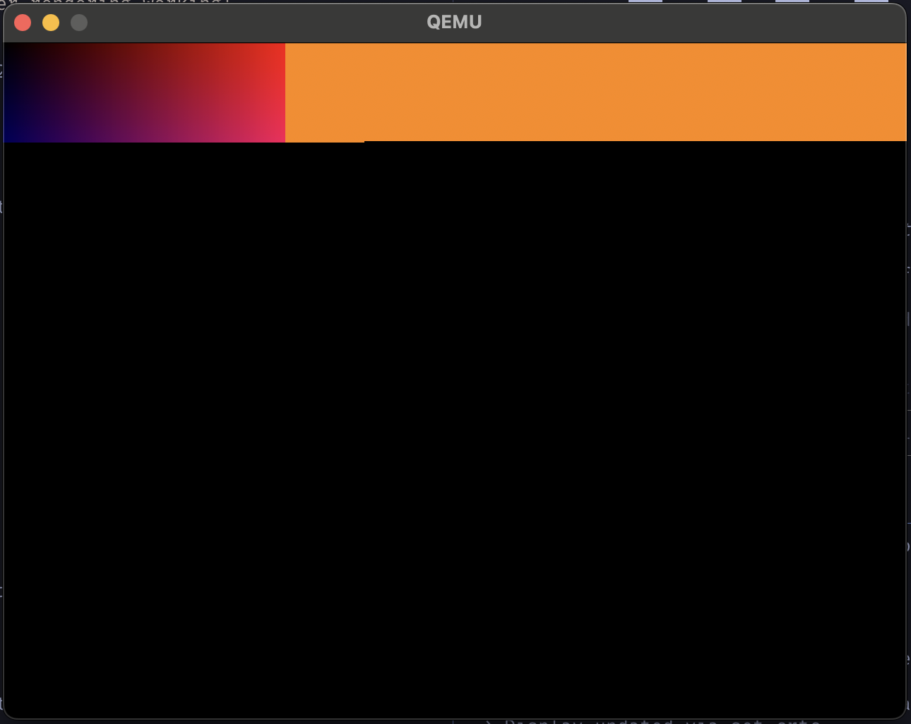

I'm working on [fundroid](https://github.com/justinmoon/fundroid), a testbed that will hopefully become a mobile Linux distro someday. To learn more about Linux graphics and DRM, I've been prototyping a basic Wayland compositor in QEMU—simpler environment, faster iteration.

The problem: the AI agent kept insisting the compositor was rendering a gradient when the screen was just black. I'd describe the black screen, it would adjust the code, then hallucinate success. The agent couldn't see what I was seeing, so it kept making the same mistakes.

## The First Attempt

My initial solution had the agent focusing windows and screenshotting my entire desktop. The QEMU window would jump to the foreground, then capture my entire desktop—terminal, browser, everything. One iteration produced a 4MB screenshot that crashed the agent chat entirely.

## The Solution: CGWindowID Magic

What I really needed was dead simple:

```bash
screenshot-window --window "QEMU" --output qemu-screen.png
```

That's it. Find the window by name, capture it, done.

The key insight: macOS's [`CGWindowListCopyWindowInfo`](https://developer.apple.com/documentation/coregraphics/1455137-cgwindowlistcopywindowinfo) API lets you capture windows directly from WindowServer using their window ID. You can screenshot a window *even when it's in the background* or partially covered.

The script uses Swift to query WindowServer, automatically resizes to 1280px width to avoid context-killing file sizes, and works with macOS built-ins—no external dependencies. Check out the full implementation: [screenshot-window on GitHub Gist](https://gist.github.com/justinmoon/002e3cb6c5add359f9270dd2dbef9971)



*The gradient rendering after fixing the compositor.*
